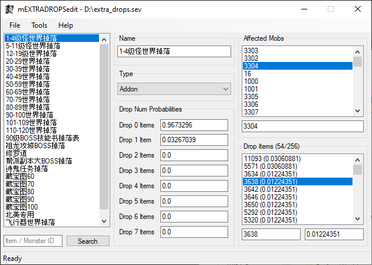

# mEXTRADROPSedit

A Minimal extra_drops.sev Editor for Perfect World.

This project was originally released on RaGEZONE as v1.0.0.0. This project was
re-released under the GPL license as of v1.0.1.

## What is it?

This is an editor for extra_drops.sev found in gamed/config. The extra_drops.sev
file controls the Additional Drops table. The Additional Drops table is a
secondary drop table independent from the one in elements.data. This is the same
"Additional Drops" in pwdatabase.com.

This is a "minimal" editor. In other words, the editor only includes basic
functionalities.

## Why edit extra_drops.sev?

Being able to edit the Additional Drops table gives you more control over how
mobs on your server drop items. For example, using the Additional Drops table,
you can make some items guaranteed to drop every time while still allowing other
items to drop randomly.

I did not find an editor for extra_drops.sev, so I decided to develop it myself.

## How to edit?

1. The structure of the file is that there are a bunch of Entries.
2. Every entry is its own Additional Drop table.
3. Every entry has a name for labeling purposes only.
4. Every entry contains the probability of dropping 0-7 items.
5. Every entry can have any number of mob ids. Listing a mob id makes the mob
   use the Additional Drop table given by the entry.
6. Every entry can have up to 256 item ids and probability. This controls which
   items are dropped, and the probability of the item being selected out of all
   256 items.

## Who made it?

This was made by myself.

Special thanks to Teemo Cell for the Structure Files.

## Where can it be used?

This was tested only on 1.5.3. However, it is possible that it will work on older versions too.

You will need the .NET Framework v4.5.1 to run the editor.

## Screenshot

## License

mEXTRADROPSedit is available under the [GPL license](https://www.gnu.org/licenses/gpl-3.0.en.html).
